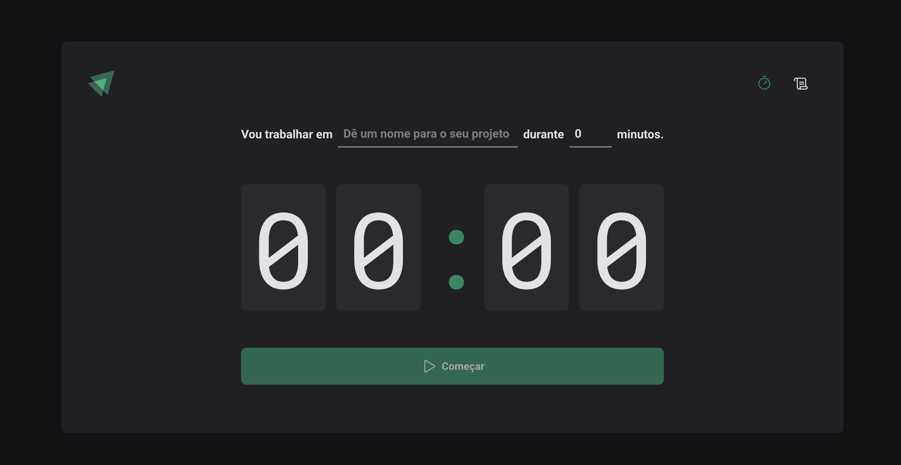

# ⏱️ Ignite Timer

Ignite Timer é uma aplicação de timer de produtividade, inspirada na técnica Pomodoro, onde você pode definir uma tarefa, estipular um tempo e acompanhar seu progresso. Ideal para organizar seu foco durante as sessões de trabalho.



## 🚀 Funcionalidades

- ⌨️ Defina o nome do projeto/tarefa que irá realizar
- ⏲️ Escolha o tempo de foco (em minutos)
- ▶️ Inicie, pause e reinicie o cronômetro
- 📋 Visualize o histórico de tarefas
- 📈 Veja o status de cada tarefa (Concluída, Interrompida, Em andamento)

## 💻 Tecnologias utilizadas

- [React](https://reactjs.org/)
- [Vite](https://vitejs.dev/)
- [TypeScript](https://www.typescriptlang.org/)
- [Styled Components](https://styled-components.com/)
- [Zod](https://zod.dev/)
- [React Hook Form](https://react-hook-form.com/)
- [React Router DOM](https://reactrouter.com/)
- [Immer](https://immerjs.github.io/immer/)

## 📦 Instalação

Clone o repositório:

```bash
git clone https://github.com/eduardossimas/ignite-timer.git
cd ignite-timer
```

Instale as dependências:

```bash
# usando npm
npm install

# ou usando yarn
yarn
```

Inicie o projeto:

```bash
# usando npm
npm run dev

# ou usando yarn
yarn dev
```

Abra no navegador:

[http://localhost:5173](http://localhost:5173)

## 📁 Estrutura do projeto

- `src/`: Contém todo o código-fonte da aplicação.
  - `components/`: Componentes reutilizáveis da interface, como botões e formulários.
  - `contexts/`: Contextos do React para gerenciamento de estado global, como o ciclo de tarefas.
  - `pages/`: Páginas principais da aplicação (`Home` e `History`).
  - `reducers/`: Redutores utilizados para controle de estado com o `useReducer`.
  - `styles/`: Estilos globais da aplicação com styled-components.
  - `App.tsx`: Arquivo principal de roteamento.
  - `main.tsx`: Ponto de entrada da aplicação.

## 📄 Licença

Este projeto está sob a licença MIT. Veja o arquivo [LICENSE](LICENSE) para mais detalhes.

---

Feito com 💻 por [Eduardo Simas](https://github.com/eduardossimas)
